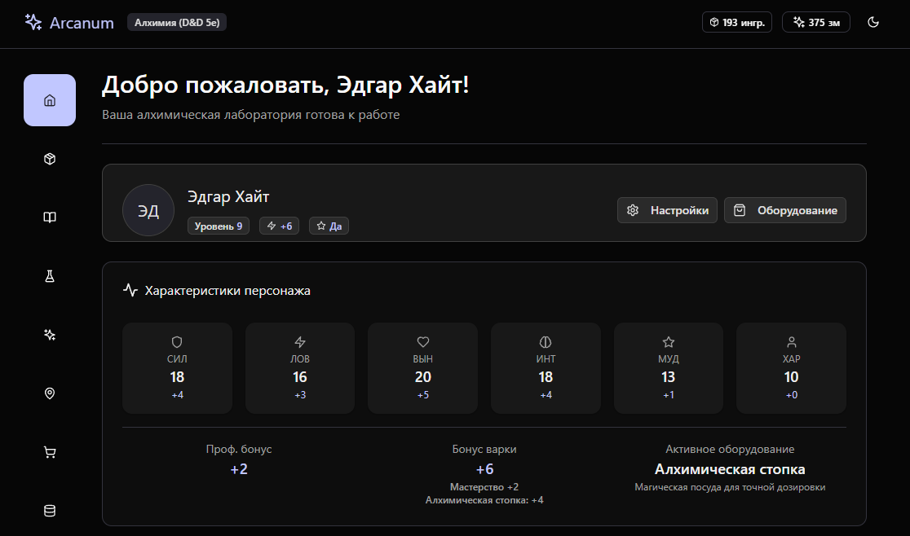
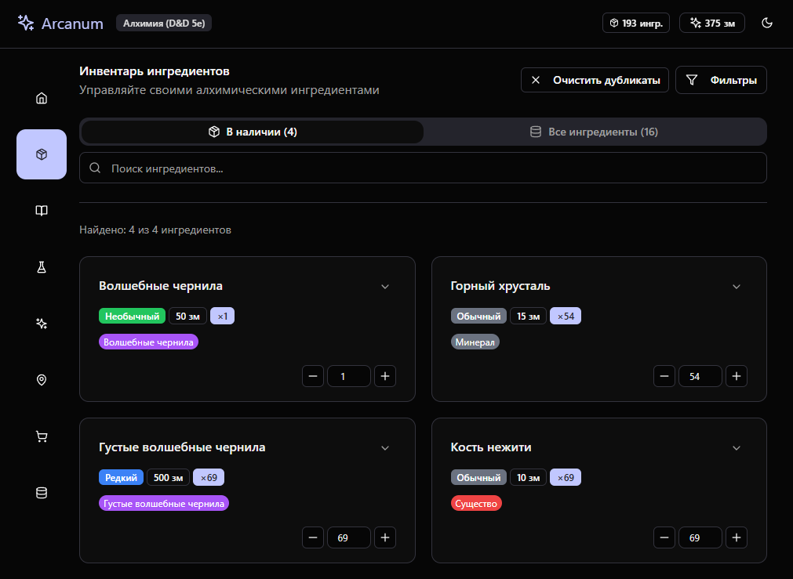
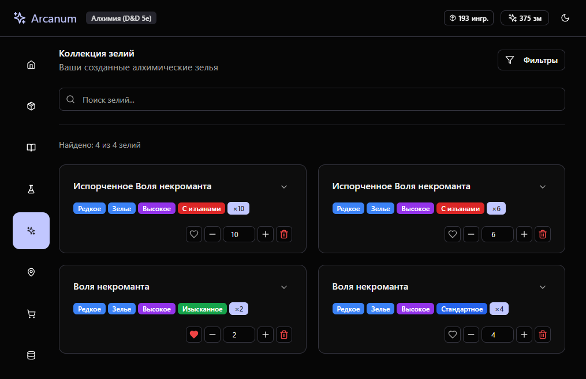

<div align="center">

# 

### **Алхимический помощник для D&D 5e**

[](https://reactjs.org/)
[](https://www.typescriptlang.org/)
[](https://vitejs.dev/)
[](https://tailwindcss.com/)
[](https://zustand-demo.pmnd.rs/)
[](https://www.framer.com/motion/)

[](LICENSE)
[](package.json)
[](https://github.com/your-username/arcanum)

---

**Полнофункциональное веб-приложение для управления алхимией в настольных ролевых играх D&D 5e**

[Демо](#-демонстрация) • [Установка](#-установка) • [Функции](#-функции) • [Документация](#-документация) • [Вклад в проект](#-вклад-в-проект)

</div>


---

## 📖 Описание

**Arcanum** — это современное веб-приложение, созданное специально для игроков и мастеров D&D 5e, которые хотят углубиться в мир алхимии. Приложение предоставляет полный набор инструментов для управления ингредиентами, создания зелий, исследования локаций и отслеживания прогресса персонажа.

### 🎯 Ключевые особенности

- **Интуитивный интерфейс** с современным дизайном
- **Полная совместимость** с правилами D&D 5e
- **Система персонажей** с характеристиками и навыками
- **Управление инвентарем** ингредиентов и зелий
- **Лаборатория варки** с расчетом шансов успеха
- **Система исследования** различных биомов
- **Торговая система** с экономикой D&D
- **Темная/светлая тема** для комфортной игры

---

## 🚀 Демонстрация

### Главная страница

### Лаборатория варки


### Управление ингредиентами


### Коллекция зелий


---

## ⚡ Быстрый старт

### Предварительные требования

- **Node.js** версии 16.0 или выше
- **npm** или **yarn** для управления пакетами
- Современный веб-браузер с поддержкой ES6+

### Установка

```bash
# Клонирование репозитория
git clone https://github.com/your-username/arcanum.git
cd arcanum

# Установка зависимостей
npm install
# или
yarn install

# Запуск в режиме разработки
npm run dev
# или
yarn dev

# Сборка для продакшена
npm run build
# или
yarn build
```

### Доступ к приложению

После запуска приложение будет доступно по адресу: `http://localhost:5173`

---

## 🛠 Технологический стек

### Frontend
| Технология | Версия | Назначение |
|------------|--------|------------|
| **React** | 18.2.0 | UI библиотека |
| **TypeScript** | 5.0.2 | Типизация |
| **Vite** | 4.4.5 | Сборщик и dev-сервер |
| **Tailwind CSS** | 3.3.3 | Стилизация |
| **Framer Motion** | 12.23.21 | Анимации |

### UI Компоненты
| Библиотека | Версия | Описание |
|------------|--------|----------|
| **Radix UI** | 1.x | Примитивные компоненты |
| **Lucide React** | 0.263.1 | Иконки |
| **Class Variance Authority** | 0.7.0 | Управление классами |
| **React Hook Form** | 7.45.4 | Управление формами |

### State Management
| Библиотека | Версия | Назначение |
|------------|--------|------------|
| **Zustand** | 4.4.1 | Управление состоянием |
| **Next Themes** | 0.3.0 | Управление темами |


---

## 🎮 Функции

### 👤 Управление персонажем
- **Создание и настройка** персонажа с характеристиками D&D
- **Система уровней** от 1 до 20
- **Навыки и мастерство** инструментов алхимика
- **Оборудование** с бонусами к варке
- **Валютная система** D&D (платина, золото, серебро, медь)

### 🧪 Алхимическая лаборатория
- **Книга рецептов** с поиском и фильтрацией
- **Система варки** с расчетом шансов успеха
- **Два режима**: процентный и TTRPG (d20 против СЛ)
- **Визуальная индикация** готовности к варке
- **Отслеживание прогресса** и статистики

### 📦 Управление инвентарем
- **Каталог ингредиентов** с детальной информацией
- **Система редкости** (обычные, необычные, редкие, очень редкие, легендарные, артефакты)
- **Поиск и фильтрация** по типу, редкости, тегам
- **Количественный учет** всех ресурсов

### 🗺 Система исследования
- **Различные биомы** с уникальными ингредиентами
- **Система сложности** исследования
- **Вероятностная система** находок
- **Экономическая модель** затрат на исследование

### 🏪 Торговая система
- **Покупка ингредиентов** и оборудования
- **Продажа зелий** и излишков
- **Динамическое ценообразование** на основе редкости
- **Управление финансами** персонажа

---

## 🏗 Архитектура проекта

```
arcanum/
├── 📁 components/           # React компоненты
│   ├── 📁 cards/           # Карточки для отображения данных
│   ├── 📁 common/          # Общие компоненты
│   ├── 📁 forms/           # Формы
│   ├── 📁 pages/           # Страницы приложения
│   └── 📁 ui/              # UI компоненты (Radix UI)
├── 📁 data/                # JSON данные
│   ├── biomes.json         # Биомы для исследования
│   ├── equipment.json      # Алхимическое оборудование
│   ├── ingredients.json    # Ингредиенты
│   └── recipes.json        # Рецепты зелий
├── 📁 hooks/               # React хуки и состояние
│   ├── 📁 stores/          # Zustand stores
│   └── types.ts            # TypeScript типы
├── 📁 styles/              # Стили
│   └── global.css          # Глобальные стили
├── 📁 utils/               # Утилиты
└── 📄 README.md            # Документация
```

### 🧩 Основные компоненты

| Компонент | Описание | Файл |
|-----------|----------|------|
| `App.tsx` | Главный компонент приложения | `App.tsx` |
| `HomePage` | Главная страница с персонажем | `components/pages/HomePage.tsx` |
| `LaboratoryPage` | Лаборатория варки зелий | `components/pages/LaboratoryPage.tsx` |
| `InventoryPage` | Управление ингредиентами | `components/pages/InventoryPage.tsx` |
| `RecipesPage` | Книга рецептов | `components/pages/RecipesPage.tsx` |
| `ExplorationPage` | Система исследования | `components/pages/ExplorationPage.tsx` |
| `ShopPage` | Торговая лавка | `components/pages/ShopPage.tsx` |

### 🗃 Управление состоянием

| Store | Назначение | Файл |
|-------|------------|------|
| `useAlchemyStore` | Основная логика алхимии | `hooks/stores/useAlchemyStore.ts` |
| `useCharacterStore` | Управление персонажем | `hooks/stores/useCharacterStore.ts` |
| `useInventoryStore` | Инвентарь и ресурсы | `hooks/stores/useInventoryStore.ts` |
| `useFiltersStore` | Фильтры и поиск | `hooks/stores/useFiltersStore.ts` |

---


## 🧪 Система варки зелий

### Режимы варки

#### 1. Процентный режим
- Показывает **шанс успеха в процентах**
- Простой и понятный для новичков
- Рассчитывается на основе характеристик персонажа

#### 2. TTRPG режим
- Симулирует **бросок d20 против Сложности (СЛ)**
- Полностью соответствует правилам D&D 5e
- Учитывает бонусы от мастерства и оборудования

---

## 🔧 Разработка

### Настройка окружения

```bash
# Установка зависимостей для разработки
npm install

# Запуск линтера
npm run lint

# Проверка типов TypeScript
npx tsc --noEmit

# Сборка проекта
npm run build

# Предварительный просмотр сборки
npm run preview
```

### Структура коммитов

```
feat: добавлена новая функция
fix: исправлена ошибка
docs: обновлена документация
style: изменения в стилях
refactor: рефакторинг кода
test: добавлены тесты
chore: обновление зависимостей
```

### Создание Pull Request

1. **Форкните** репозиторий
2. **Создайте** ветку для новой функции: `git checkout -b feature/amazing-feature`
3. **Зафиксируйте** изменения: `git commit -m 'feat: add amazing feature'`
4. **Отправьте** в ветку: `git push origin feature/amazing-feature`
5. **Откройте** Pull Request

---

## 🤝 Вклад в проект

Мы приветствуем вклад в развитие Arcanum! Вот несколько способов помочь:

### 🐛 Сообщения об ошибках
- Используйте [GitHub Issues](https://github.com/your-username/arcanum/issues)
- Опишите проблему подробно
- Приложите скриншоты, если возможно

### 💡 Предложения функций
- Обсудите идею в [Discussions](https://github.com/your-username/arcanum/discussions)
- Опишите пользу для сообщества
- Предложите реализацию

### 📝 Улучшение документации
- Исправьте опечатки
- Добавьте примеры использования
- Переведите на другие языки

### 🧪 Тестирование
- Тестируйте новые функции
- Сообщайте о багах
- Предлагайте улучшения UX

---

## 📄 Лицензия

Этот проект лицензирован под лицензией MIT - см. файл [LICENSE](LICENSE) для деталей.

---

## 👥 Авторы

- **Денис Русинов** - *Основной разработчик* - [GitHub](https://github.com/DenisML51/)

### Благодарности

- Сообществу **D&D 5e** за вдохновение
- Сообществу **Критический подвал** за правила по алхимии и рецепты


---

## 🔗 Полезные ссылки

- [D&D 5e SRD](https://dnd.wizards.com/resources/systems-reference-document)
- [React Documentation](https://reactjs.org/docs)
- [TypeScript Handbook](https://www.typescriptlang.org/docs)
- [Tailwind CSS Docs](https://tailwindcss.com/docs)
- [Vite Guide](https://vitejs.dev/guide)

---


<div align="center">

### ⭐ Если проект вам понравился, поставьте звезду!

**Arcanum** - ваш надежный спутник в мире алхимии D&D 5e

[](https://github.com/DenisML51/Arcanum)
[](https://github.com/DenisML51/Arcanum/issues)


---

*Создано с ❤️ для сообщества D&D*

</div>
